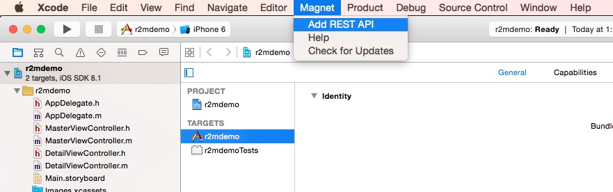
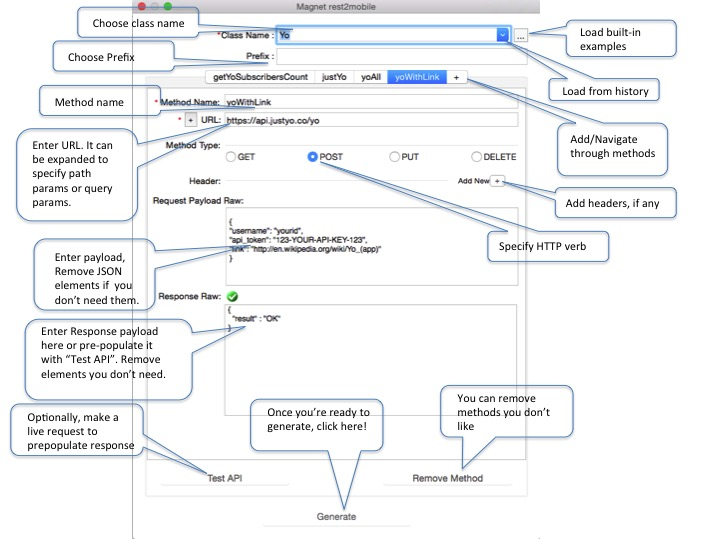
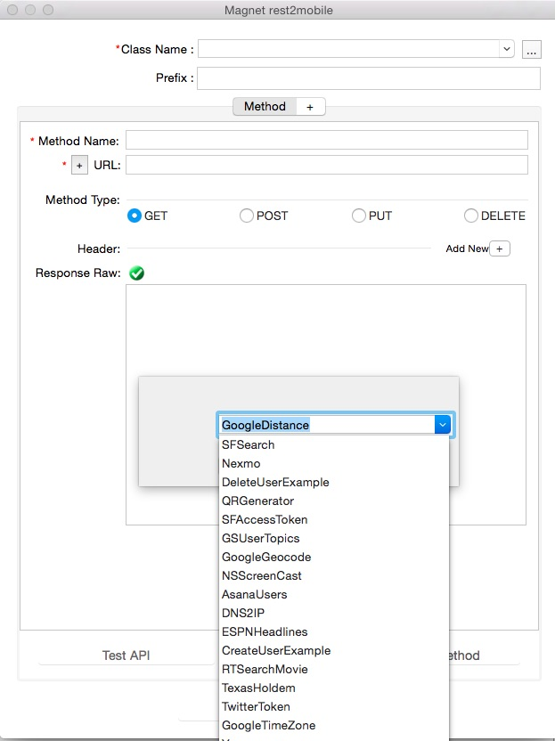
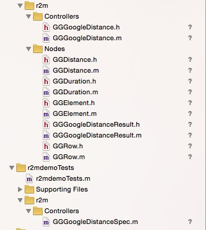
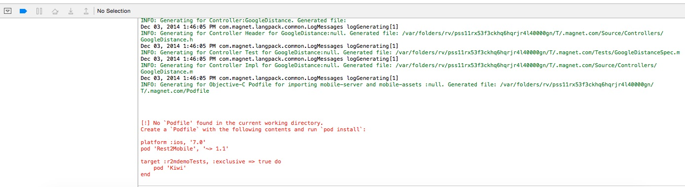

rest2mobile plugin for Xcode
==============

The rest2mobile plugin for Xcode generates Objective-C code for your iOS app to interface with REST services. You can find a video [here](http://youtu.be/6qVBB5bKCaM) describing how to install and use it.

Go to the http://developer.magnet.com for more info about the command-line tool and Android Studio plugin.

## Prerequisites
The rest2mobile plugin for Xcode has these prerequisites:

* Java JDK 1.6 or later
* Xcode 5 or 6

## Releases

Find all releases [here](https://github.com/magnetsystems/r2m-plugin-ios/releases).

Current release:
* [1.1.1](https://github.com/magnetsystems/r2m-plugin-ios/releases/download/v1.1.1)
 

The following picture is a screenshot of the plugin: 


## Setup

__Step 1: Install plugin__
The installation instructions are summarized [here](http://developer.magnet.com/ios) or simply run this script:

```
curl https://github.com/magnetsystems/r2m-plugin-ios/releases/download/v1.1.1/r2m-Xcode-plugin.zip -O -L
mkdir -p ~/Library/Application\ Support/Developer/Shared/Xcode/Plug-ins
unzip -o r2m-Xcode-plugin.zip -d ~/Library/Application\ Support/Developer/Shared/Xcode/Plug-ins
```

__Step 2: (Re)start XCode__
Once Xcode is up, you should see the new Magnet menu:



Choose "Add new API" from the Magnet menu. The following describes the wizard options:



Alternatively, instead of crafting your own REST invocations, you can load existing examples from the [r2m-examples github repo](https://github.com/magnetsystems/r2m-examples) by clicking on the browse icon next to the <code>Class Name</code> box:



__STEP 3: Generate code__

Click on "Generate", this generates the code under the <code>r2m</code> directory.A Kiwi unit test file is also generated under the <code><projectName>Tests</code> directory.

Ex: say you selected the <code>GoogleDistance</code> built-in example, and your project is called <code>r2mdemo</code> you should see the following files in the project navigator pane under the <code>r2mdemo</code> directory:



__Step 4: Apply PodFile__

You should also see an error in the debug area window if you haven't installed the R2M SDK for Android. 



In this case, close Xcode, and apply the podfile in th
Go to your Xcode project folder and create the following Podfile:
```
platform :ios, '7.0'
pod 'Rest2Mobile', '~> 1.1'

# Add Kiwi as an exclusive dependency for the AmazingAppTests target
target :AmazingAppTests, :exclusive => true do
  pod 'Kiwi'
end
```

Run the following command from your project directory:
``` 
 > pod install
``` 
Open your project using the .xcworkspace file.

You are now ready to use the controller in your classes.

__STEP 5: Test__

Use the generated unit test generated under <code><projectName>Tests</code>. In this example, it will be
<code>r2mdemo/r2mdemoTests/GoogleDistanceTests.m


Ex: if you generated the <code>GoogleDistance</code> native API, the unit test can be found atr <code>src/androidTest/java/com/magnetapi/examples/controller/api/test/GoogleDistanceTest</code>. Remove the <code>@Supress</code> annotation on <code>testGoogleDistance</code>, and invoke the API with real values:

## License

Licensed under the **[Apache License, Version 2.0] [license]** (the "License");
you may not use this software except in compliance with the License.

## Copyright

Copyright © 2014 Magnet Systems, Inc. All rights reserved.

[website]: http://developer.magnet.com
[techdoc]: https://github.com/magnetsystems/rest2mobile/wiki
[r2m-plugin-android]:https://github.com/magnetsystems/r2m-plugin-android/
[r2m-plugin-ios]:https://github.com/magnetsystems/r2m-plugin-ios/
[r2m-cli]:https://github.com/magnetsystems/r2m-cli/
[license]: http://www.apache.org/licenses/LICENSE-2.0
[r2m wiki]:https://github.com/magnetsystems/r2m-cli/wiki
