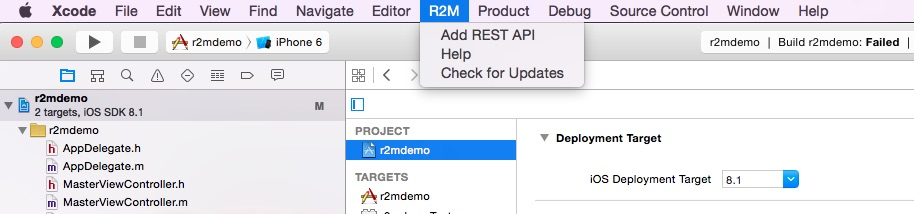

rest2mobile plugin for Xcode
==============

The rest2mobile plugin for Xcode generates Objective-C code for your iOS app to interface with REST services. You can find a video [here](http://youtu.be/6qVBB5bKCaM) describing how to install and use it.

Go to the http://developer.magnet.com for more info about the command-line tool and Android Studio plugin.

## Prerequisites
The rest2mobile plugin for Xcode has these prerequisites:

* Java JDK 1.6 or later
* Xcode 5 or 6

## Releases

Find all releases [here](https://github.com/magnetsystems/r2m-plugin-ios/releases).

Current release:
* [1.1.1](https://github.com/magnetsystems/r2m-plugin-ios/releases/download/v1.1.1)
 

The following picture is a screenshot of the plugin: 


## Setup

__Step 1: Install plugin__
The installation instructions are summarized [here](http://developer.magnet.com/ios) or simply run this script:

```
curl https://github.com/magnetsystems/r2m-plugin-ios/releases/download/v1.1.1/r2m-Xcode-plugin.zip -O -L
mkdir -p ~/Library/Application\ Support/Developer/Shared/Xcode/Plug-ins
unzip -o r2m-Xcode-plugin.zip -d ~/Library/Application\ Support/Developer/Shared/Xcode/Plug-ins
```

__Step 2: (Re)start XCode__
Once Xcode is up, you should see the new R2M menu (on older version this menu is named "Magnet"):



Choose "Add new API" from the R2M menu (or "Magnet" menu on older version). The following describes the wizard options:


Alternatively, instead of crafting your own REST invocations, you can load existing examples from the [r2m-examples github repo](https://github.com/magnetsystems/r2m-examples) by clicking on the browse icon next to the <code>Class Name</code> box:


__STEP 3: Generate code__

After filling the form, click on "Generate" to generate the code. This generates code under the <code>r2m</code> directory. A Kiwi unit test file is also generated under the <code><projectName>Tests</code> directory.

For example, let's say you decided to use the <code>GoogleDistance</code> built-in example. Select it from the drop-down menu, and specify a prefix (say, <code>GG</code>). Click on "Generate", you should now see the controller, node, and test classes:
* Controller classes are generated under <code><ProjectName>/r2m/Controllers</code> 
* Test class is generated under <code><ProjectName>Tests/r2m/Controllers</code> 
* Model classes are generated under <code><ProjectName>/r2m/Nodes</code> 


__NOTE__ in the rest of this tutorial, we assume that your project name is 'r2mdemo'

__Step 4: Apply PodFile__

You should also see an error in the debug area window if you haven't installed the R2M SDK for iOS. 


In this case, copy the PodFile snippet, and close Xcode. Then go to your Xcode project folder and create a podFile and paste the Podfile snippet into it. 
It should look like this, be sure to replace <code>r2mdemoTests</code> with the actual test directory name corresponding to your project (<projectName>Tests)
```
platform :ios, '7.0'
pod 'Rest2Mobile', '~> 1.1'

target :r2mdemoTests, :exclusive => true do
  pod 'Kiwi'
end
```

Now install the pod dependencies by running following command from your project directory:
``` 
 > pod install
``` 
__IMPORTANT__ ! you must re-open your project using the <projectName>.xcworkspace file (in our case <code>r2mdemo.xcworkspace</code>)


__STEP 5: Test__

Use the generated unit test generated under <code><projectName>Tests</code>. In this example, it will be
<code>r2mdemo/r2mdemoTests/r2m/Controllers/GoogleDistanceSpec.m</code>

This test is a template class, you can adapt it with the following code.
```objective-c
//
//  GGGoogleDistanceSpec.m
//
//  File generated by Magnet rest2mobile 1.1 - Dec 3, 2014 3:54:22 PM
//  @See Also: http://developer.magnet.com
//
#import <Kiwi/Kiwi.h>
#import "GGGoogleDistance.h"
#import "GGGoogleDistanceResult.h"
#import "GGGoogleDistance.h"
#import "GGGoogleDistanceResult.h"
#import "GGElement.h"
#import "GGRow.h"
#import "GGDistance.h"

#define DEFAULT_TEST_TIMEOUT 5.0

SPEC_BEGIN(GGGoogleDistanceSpec)

describe(@"GGGoogleDistance", ^{

    GGGoogleDistance *sut = [[GGGoogleDistance alloc] init];


    context(@"when calling googleDistance", ^{

        it(@"should invoke", ^{
            NSString *origins = @"435 Tasso Street, Palo Alto, CA";
            NSString *destinations = @"1 Embarcadero Street, San Francisco, CA";
            NSString *sensor = @"false";
            NSString *mode = @"bicycling";
            NSString *language = @"en";
            NSString *units = @"metric";

            __block NSString *_distance;
            [sut googleDistance:origins
                   destinations:destinations
                         sensor:sensor
                           mode:mode
                       language:language
                          units:units
                        success:^(GGGoogleDistanceResult *response){
                            GGRow *row = response.rows.firstObject;
                            GGElement *element = row.elements.firstObject;
                            GGDistance *distance = element.distance;
                            _distance = distance.text;
                        }
                        failure:^(NSError *error){
                        }];

            // Assert
            [[expectFutureValue(_distance) shouldEventuallyBeforeTimingOutAfter(DEFAULT_TEST_TIMEOUT)] equal:@"some value"];
        });
    });


});

SPEC_END

```

In this tests, we import the header files corresponding to the generated model and controller classes. The test calls the google distance REST API through the GoogleDistanceController to calculate the distance between 2 addresses in kilometers. 
Finally, it verifies that the distance value.

Now run the test, by clicking on Run->Test (Command+U). 
You'll see the test failing with the error:
```
[FAILED] expected subject to equal (NSString) "some value", got "55.6km"
```
In a true Test Driven development fashion, we made the test fail first, now replace "some value" with "55.6km"

That is, replace the line:
```objective-c
[[expectFutureValue(_distance) shouldEventuallyBeforeTimingOutAfter(DEFAULT_TEST_TIMEOUT)] equal:@"some value"];
```
with
```objective-c
[[expectFutureValue(_distance) shouldEventuallyBeforeTimingOutAfter(DEFAULT_TEST_TIMEOUT)] equal:@"55.6km"];
```

And re-run the test (Run->Test or Command+U). The test is now successful.

Congratulations! You created the Google Distance controller using Rest2Mobile! You can now create your own controller for any REST API that you want. 

## License

Licensed under the **[Apache License, Version 2.0] [license]** (the "License");
you may not use this software except in compliance with the License.

## Copyright

Copyright © 2014 Magnet Systems, Inc. All rights reserved.

[website]: http://developer.magnet.com
[techdoc]: https://github.com/magnetsystems/rest2mobile/wiki
[r2m-plugin-android]:https://github.com/magnetsystems/r2m-plugin-android/
[r2m-plugin-ios]:https://github.com/magnetsystems/r2m-plugin-ios/
[r2m-cli]:https://github.com/magnetsystems/r2m-cli/
[license]: http://www.apache.org/licenses/LICENSE-2.0
[r2m wiki]:https://github.com/magnetsystems/r2m-cli/wiki
